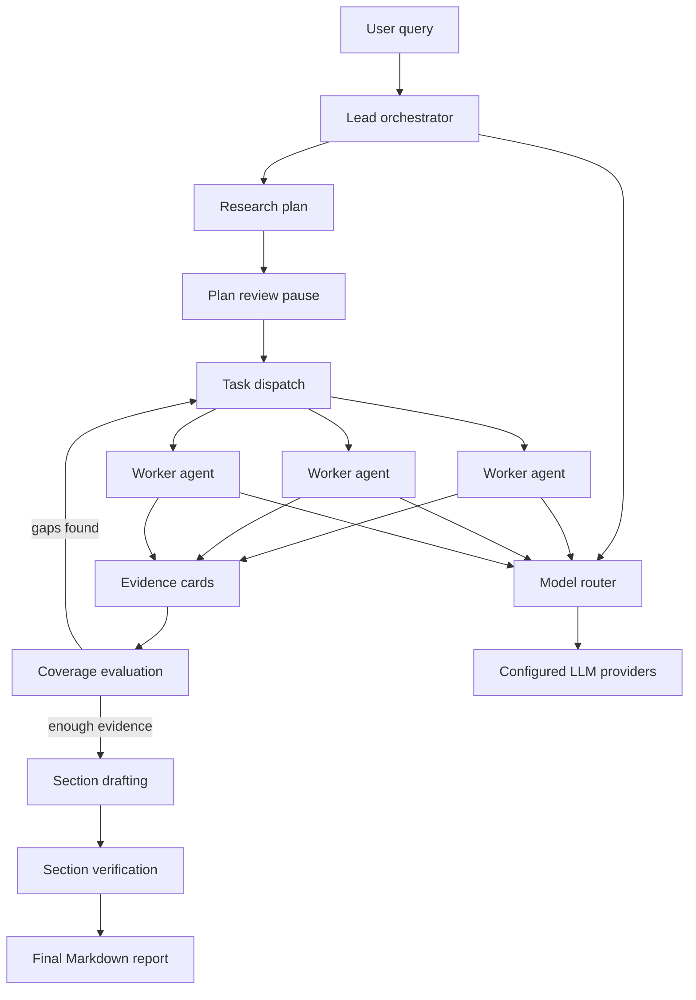

# deep_research

`deep_research` is a multi-agent research application that turns a user query into a source-backed Markdown report.

The system does not answer directly from a single prompt. It plans the research, pauses for plan review, sends scoped tasks to worker agents, validates evidence, fills coverage gaps, drafts report sections from supported material, and assembles the final report with references.

# Demo video

https://github.com/user-attachments/assets/64ad5106-990b-4465-ac31-1687bbc08e12

## Architecture

The application is organized around a lead-worker model:

- the lead orchestrator owns the research plan, coverage checks, section structure, and final synthesis
- worker agents independently collect evidence for narrow research tasks
- a model router selects from available LLM providers and handles fallback when a provider is rate-limited or unavailable
- checkpointing and job state allow long-running research flows to pause, resume, and stream progress

## Lead Orchestrator

The lead orchestrator is responsible for the full research lifecycle.

It:

- decomposes the original query into focused research tasks
- defines the report sections the answer should cover
- builds a research contract based on query type and evidence needs
- pauses after planning so the user can approve or revise the plan
- dispatches worker agents with bounded tasks
- evaluates whether collected evidence is sufficient
- creates additional gap-research tasks when coverage is weak
- builds section-level evidence packets
- drafts, expands, verifies, and repairs report sections
- assembles the final Markdown report and references

The lead agent does not simply merge worker output. It checks whether evidence is deep enough to support the report before drafting.

## Worker Agents

Worker agents handle individual research tasks.

Each worker follows a bounded loop:

1. search for relevant sources
2. scrape selected pages
3. extract findings and evidence cards
4. submit only evidence tied to scraped URLs

Worker output is structured so the lead agent can evaluate it consistently:

- factual findings
- evidence-backed claims
- source URLs
- source titles
- excerpts
- source type
- authority score
- confidence score
- coverage tags

This structure keeps the final report tied to traceable sources instead of free-form summaries.

## Evidence Flow

Evidence moves through the system in stages:

1. workers discover and scrape sources
2. low-value, duplicate, or irrelevant sources are filtered
3. evidence cards are validated against scraped URLs
4. the lead agent checks source diversity, authority, and section coverage
5. weak sections trigger targeted follow-up research
6. supported evidence is grouped into section packets
7. drafted sections cite evidence IDs before the final report is assembled

The system can produce a partial report when enough evidence exists for some sections but not the full planned outline.

## Model Routing

Model calls are routed through a provider layer rather than hardcoded to one model.

The router supports:

- planning
- evaluation
- worker tool-calling
- evidence brief generation
- section drafting
- section verification
- section repair
- final synthesis

It tracks local request and token budgets, applies provider cooldowns, and can switch providers when one is unavailable.

## Output

The final output is a Markdown report built from validated evidence. A typical report includes:

- title
- executive summary
- key findings
- evidence and methodology notes
- body sections
- limitations when evidence is incomplete
- conclusion
- references

## Output Examples

_Add real outputs here_

